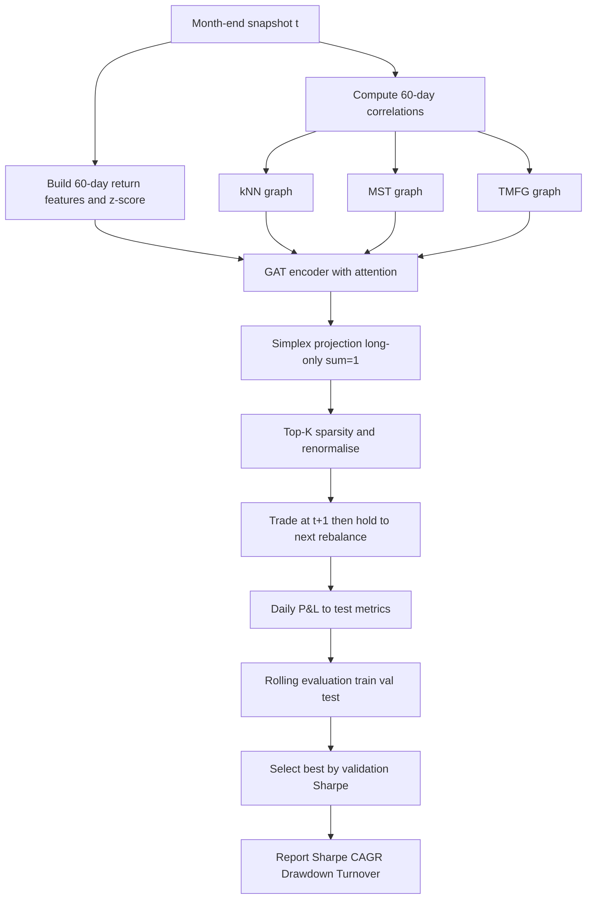
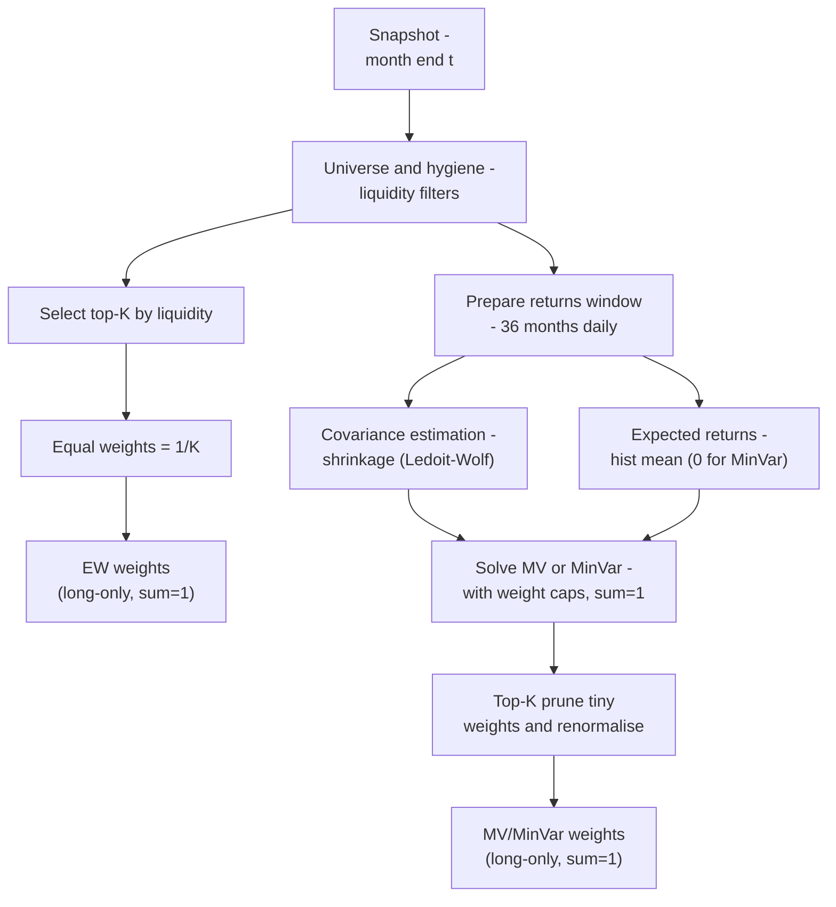
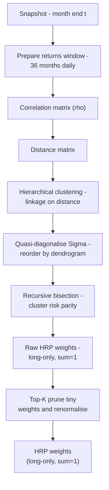
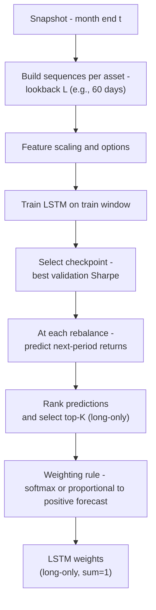

---


---


---

```mermaid
flowchart TD
  subgraph Snapshot
    A[Month-end snapshot t]
  end

  subgraph Features_and_Corr
    B[Build 60d return features and z-score]
    C[Compute 60d correlations]
  end

  subgraph Graph_Filter
    D1[kNN graph]
    D2[MST graph]
    D3[TMFG graph]
  end

  subgraph Model
    E[GAT with attention]
    F[Simplex projection long only sum=1]
    G[Top K sparsity and renormalise]
  end

  subgraph Backtest
    H[Trade at t+1 and hold to next rebalance]
  end

  subgraph Evaluation
    I[Daily PnL]
    J[Test metrics Sharpe CAGR Drawdown]
    K[Rolling evaluation train val test]
    L[Select best by validation Sharpe]
    M[Report figures and tables]
  end

  A --> B
  A --> C
  C --> D1
  C --> D2
  C --> D3
  B --> E
  D1 --> E
  D2 --> E
  D3 --> E
  E --> F
  F --> G
  G --> H
  H --> I
  I --> J
  J --> K
  K --> L
  L --> M
  ```

  ```mermaid
  flowchart TD
  subgraph Backtest
    H[Trade at t+1<br/>Hold to next rebalance]
  end

  subgraph Evaluation
    I[Daily PnL]
    J[Test metrics:<br/>Sharpe, CAGR, Drawdown]
    K[Rolling evaluation:<br/>train / val / test]
    L[Model selection:<br/>best validation Sharpe]
    M[Reporting:<br/>figures and tables]
  end

  H --> I --> J --> K --> L --> M
```








```mermaid
gantt
    title ANL488 — Project Timeline (Sep–Nov 2025)
    dateFormat  YYYY-MM-DD
    axisFormat  %b %d
    excludes    weekends

    section Milestones
    Submit Proposal           :milestone, m_proposal, 2025-09-05, 1d
    Draft Presentation Deck   :milestone, m_deck,     2025-09-24, 1d
    Submit Report             :milestone, m_report,   2025-11-03, 1d

    section Setup & Baselines
    Unified harness + EW/MV/HRP           :a1, 2025-09-08, 2025-09-11

    section Data & Graph Prep
    Graph builders + HRP clustering; LSTM sequences  :a2, after a1, 2025-09-12, 2025-09-14

    section First Model Pass
    Single-window training — LSTM and GAT            :a3, after a2, 2025-09-15, 2025-09-17

    section Rolling Runs & Initial Compare
    Rolling 36/12/12 for HRP, LSTM, GAT; first tables :a4, after a3, 2025-09-18, 2025-09-21

    section Robustness
    Sensitivity & robustness (Top-K, costs, linkages) :a5, after a4, 2025-09-22, 2025-09-23

    section Communication
    Deck drafting (framing, results, explainability)  :a6, after a5, 2025-09-24, 2025-10-06

    section Analysis & Write-up
    Ablations write-up; figure pack locked            :a7, after a6, 2025-10-07, 2025-10-14
    Recommendations                                   :a8, after a7, 2025-10-15, 2025-10-21
    Limitations & future direction                    :a9, after a8, 2025-10-22, 2025-11-02
```
