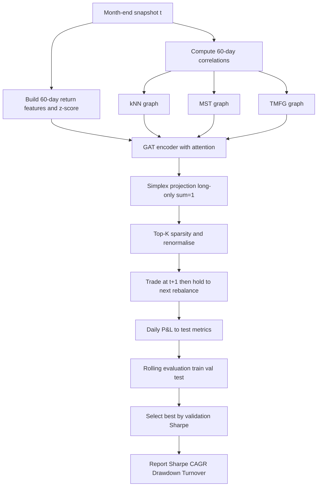

---


---


---

```mermaid
flowchart TD
  subgraph Snapshot
    A[Month-end snapshot t]
  end

  subgraph Features_and_Corr
    B[Build 60d return features and z-score]
    C[Compute 60d correlations]
  end

  subgraph Graph_Filter
    D1[kNN graph]
    D2[MST graph]
    D3[TMFG graph]
  end

  subgraph Model
    E[GAT with attention]
    F[Simplex projection long only sum=1]
    G[Top K sparsity and renormalise]
  end

  subgraph Deployment
    H[Trade at t+1 and hold to next rebalance]
  end

  subgraph Evaluation
    I[Daily PnL]
    J[Test metrics Sharpe CAGR Drawdown]
    K[Rolling evaluation train val test]
    L[Select best by validation Sharpe]
    M[Report figures and tables]
  end

  A --> B
  A --> C
  C --> D1
  C --> D2
  C --> D3
  B --> E
  D1 --> E
  D2 --> E
  D3 --> E
  E --> F
  F --> G
  G --> H
  H --> I
  I --> J
  J --> K
  K --> L
  L --> M
  ```
