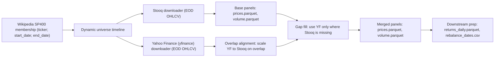

```mermaid
flowchart LR
  A["Wikipedia SP400 membership (ticker; start_date; end_date)"] --> B["Dynamic universe timeline"]
  B --> C["Stooq downloader (EOD OHLCV)"]
  B --> D["Yahoo Finance (yfinance) downloader (EOD OHLCV)"]
  C --> E["Base panels: prices.parquet, volume.parquet"]
  D --> F["Overlap alignment: scale YF to Stooq on overlap"]
  E --> G["Gap fill: use YF only where Stooq is missing"]
  F --> G
  G --> H["Merged panels: prices.parquet, volume.parquet"]
  H --> I["Downstream prep: returns_daily.parquet, rebalance_dates.csv"]
```
