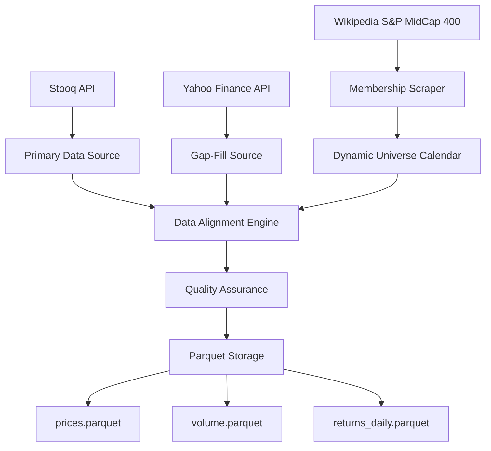

# Data Architecture

## Dynamic Universe Management

The system handles the time-varying nature of the S&P MidCap 400 index through a sophisticated universe management architecture:

```python
# Universe Calendar Structure
class UniverseCalendar:
    membership: pd.DataFrame  # columns: [ticker, start_date, end_date]
    rebalance_dates: pd.DatetimeIndex  # Monthly end dates
    active_universe_cache: Dict[pd.Timestamp, List[str]]
    
    def get_active_tickers(self, date: pd.Timestamp) -> List[str]:
        """Return active tickers for given date, avoiding survivorship bias."""
        
    def get_universe_transitions(self, 
                               start: pd.Timestamp, 
                               end: pd.Timestamp) -> pd.DataFrame:
        """Identify additions/deletions over period."""
```

## Multi-Source Data Pipeline Architecture

The data architecture implements a robust multi-source integration system with automatic gap-filling:



## Storage Architecture: Parquet-Optimized

**Design Principles:**
- **Columnar Storage**: Parquet format optimized for analytical workloads
- **Partitioning Strategy**: Monthly partitions for efficient time-series queries
- **Compression**: GZIP compression balances space efficiency with read performance
- **Schema Evolution**: Forward-compatible schema design supports additional data sources

**Storage Schema:**
```python
# prices.parquet schema
prices_schema = {
    "date": "datetime64[ns]",       # Trading date index
    "ticker_*": "float64"           # One column per ticker (wide format)
}

# volume.parquet schema  
volume_schema = {
    "date": "datetime64[ns]",       # Trading date index
    "ticker_*": "int64"             # Volume data (wide format)
}

# returns_daily.parquet schema
returns_schema = {
    "date": "datetime64[ns]",       # Trading date index
    "ticker_*": "float64"           # Daily returns (wide format)
}
```

## Graph Construction Pipeline

The GAT architecture requires sophisticated graph construction with multiple filtering methods:

```python
@dataclass
class GraphBuildConfig:
    lookback_days: int = 252                    # Rolling correlation window
    cov_method: Literal["lw", "oas"] = "lw"     # Covariance estimation
    filter_method: Literal["mst", "tmfg", "knn"] = "tmfg"
    edge_attributes: bool = True                 # Include [ρ, |ρ|, sign]
    min_observations: int = 100                  # Min overlap for correlation
```

**Graph Construction Methods:**
1. **Minimum Spanning Tree (MST)**: Conservative backbone with N-1 edges
2. **Triangulated Maximally Filtered Graph (TMFG)**: Balanced structure with 3N-6 edges
3. **k-Nearest Neighbors (k-NN)**: Local connectivity with mutual neighbor requirement

---
