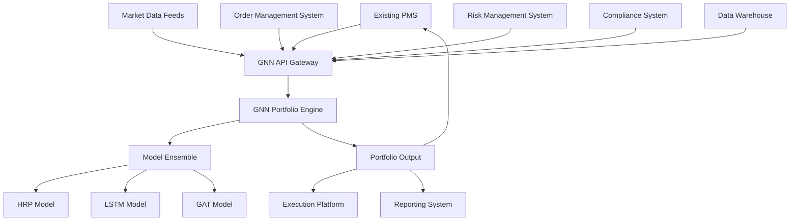

# System Integration Guide for Existing Portfolio Management Systems

## Overview

This guide provides comprehensive instructions for integrating the GNN Portfolio Optimization System with existing institutional portfolio management systems, execution platforms, and data infrastructure. The integration patterns support seamless adoption without disrupting existing workflows.

## Integration Architecture Overview

### High-Level Integration Patterns



### Integration Layers

1. **Data Integration Layer**: Market data feeds, reference data, corporate actions
2. **API Integration Layer**: REST/GraphQL APIs for portfolio generation and monitoring
3. **Execution Integration Layer**: Trade generation, order management, execution reporting
4. **Reporting Integration Layer**: Performance analytics, risk reporting, compliance reporting
5. **Authentication Layer**: SSO, API security, audit trail integration

## Portfolio Management System Integration

### Bloomberg AIM Integration

#### Configuration Setup
```python
# src/integrations/bloomberg_aim.py
"""Bloomberg Asset and Investment Manager (AIM) integration."""

import logging
from typing import Dict, List, Optional
from datetime import datetime
import pandas as pd

from src.integrations.base import PortfolioManagementSystemIntegration
from src.models.base.portfolio_model import PortfolioConstraints

logger = logging.getLogger(__name__)

class BloombergAIMIntegration(PortfolioManagementSystemIntegration):
    """Integration with Bloomberg Asset and Investment Manager (AIM)."""
    
    def __init__(self, config: Dict):
        """Initialize Bloomberg AIM integration."""
        super().__init__(config)
        self.aim_config = config["bloomberg_aim"]
        self.api_base_url = self.aim_config["api_base_url"]
        self.api_key = self.aim_config["api_key"]
        self.portfolio_codes = self.aim_config["portfolio_codes"]
        
    def fetch_current_portfolio(self, portfolio_code: str) -> pd.DataFrame:
        """Fetch current portfolio holdings from AIM."""
        
        endpoint = f"{self.api_base_url}/portfolios/{portfolio_code}/holdings"
        
        headers = {
            "Authorization": f"Bearer {self.api_key}",
            "Content-Type": "application/json"
        }
        
        response = self._make_api_request("GET", endpoint, headers=headers)
        
        if response.status_code == 200:
            holdings_data = response.json()
            
            # Convert to standard format
            portfolio_df = pd.DataFrame([
                {
                    "symbol": holding["security"]["identifier"],
                    "name": holding["security"]["name"],
                    "quantity": holding["quantity"],
                    "market_value": holding["market_value"],
                    "weight": holding["weight"],
                    "sector": holding["security"]["sector"],
                    "asset_class": holding["security"]["asset_class"]
                }
                for holding in holdings_data["holdings"]
            ])
            
            return portfolio_df
        else:
            raise Exception(f"Failed to fetch portfolio: {response.status_code}")
    
    def submit_portfolio_allocation(
        self, 
        portfolio_code: str,
        target_weights: pd.Series,
        rebalance_date: datetime,
        metadata: Dict
    ) -> str:
        """Submit target portfolio allocation to AIM."""
        
        # Prepare allocation payload
        allocation_payload = {
            "portfolio_code": portfolio_code,
            "rebalance_date": rebalance_date.isoformat(),
            "allocation_method": "GNN_ML_OPTIMIZATION",
            "model_version": metadata.get("model_version", "1.0.0"),
            "confidence_score": metadata.get("confidence_score", 0.0),
            
            "target_allocations": [
                {
                    "security_identifier": symbol,
                    "target_weight": float(weight),
                    "allocation_rationale": f"ML model recommendation (confidence: {metadata.get('confidence_score', 0.0):.2f})"
                }
                for symbol, weight in target_weights.items()
                if weight > 0.001  # Only include meaningful positions
            ],
            
            "risk_metrics": metadata.get("risk_metrics", {}),
            "expected_performance": metadata.get("expected_performance", {}),
            "compliance_validation": metadata.get("compliance_validation", {})
        }
        
        endpoint = f"{self.api_base_url}/portfolios/{portfolio_code}/allocations"
        
        response = self._make_api_request(
            "POST", 
            endpoint, 
            json=allocation_payload,
            headers={"Authorization": f"Bearer {self.api_key}"}
        )
        
        if response.status_code == 201:
            allocation_response = response.json()
            return allocation_response["allocation_id"]
        else:
            raise Exception(f"Failed to submit allocation: {response.status_code}")
    
    def get_allocation_status(self, allocation_id: str) -> Dict:
        """Get status of submitted allocation."""
        
        endpoint = f"{self.api_base_url}/allocations/{allocation_id}/status"
        
        response = self._make_api_request(
            "GET",
            endpoint,
            headers={"Authorization": f"Bearer {self.api_key}"}
        )
        
        if response.status_code == 200:
            return response.json()
        else:
            raise Exception(f"Failed to get allocation status: {response.status_code}")
```

#### AIM Integration Configuration
```yaml
# configs/integrations/bloomberg_aim.yaml
bloomberg_aim:
  api_base_url: "https://api.bloomberg.com/aim/v1"
  api_key: "${BLOOMBERG_AIM_API_KEY}"
  
  # Portfolio mappings
  portfolio_codes:
    - "EQUITY_GROWTH_001"
    - "BALANCED_FUND_002"
    - "DEFENSIVE_EQUITY_003"
  
  # Data mapping configuration
  security_identifier_type: "BLOOMBERG_TICKER"
  currency: "USD"
  
  # Integration settings
  allocation_submission_mode: "DRAFT"  # DRAFT, LIVE
  require_approval: true
  auto_rebalance: false
  
  # Risk controls integration
  enable_aim_risk_checks: true
  comply_with_aim_constraints: true
  
  # Reporting integration
  enable_performance_sync: true
  sync_frequency: "DAILY"
```

### Charles River IMS Integration

#### Charles River Integration Module
```python
# src/integrations/charles_river.py
"""Charles River Investment Management System integration."""

import json
import logging
from typing import Dict, List, Optional
from datetime import datetime
import pandas as pd
import requests

logger = logging.getLogger(__name__)

class CharlesRiverIntegration:
    """Integration with Charles River Investment Management System."""
    
    def __init__(self, config: Dict):
        """Initialize Charles River integration."""
        self.config = config["charles_river"]
        self.api_base_url = self.config["api_base_url"]
        self.username = self.config["username"]
        self.password = self.config["password"]
        self.entity_id = self.config["entity_id"]
        
        # Authentication
        self.session_token = self._authenticate()
    
    def _authenticate(self) -> str:
        """Authenticate with Charles River system."""
        
        auth_payload = {
            "username": self.username,
            "password": self.password,
            "entity_id": self.entity_id
        }
        
        response = requests.post(
            f"{self.api_base_url}/auth/login",
            json=auth_payload
        )
        
        if response.status_code == 200:
            return response.json()["session_token"]
        else:
            raise Exception("Charles River authentication failed")
    
    def create_model_portfolio(
        self,
        portfolio_name: str,
        target_weights: pd.Series,
        benchmark: str,
        portfolio_manager: str
    ) -> str:
        """Create model portfolio in Charles River."""
        
        # Prepare model portfolio specification
        model_portfolio = {
            "name": portfolio_name,
            "description": f"GNN ML-optimized portfolio created on {datetime.now().isoformat()}",
            "benchmark": benchmark,
            "portfolio_manager": portfolio_manager,
            "creation_method": "ML_OPTIMIZATION",
            
            "target_weights": [
                {
                    "security_id": symbol,
                    "weight": float(weight),
                    "weight_type": "MARKET_VALUE"
                }
                for symbol, weight in target_weights.items()
                if weight > 0.001
            ],
            
            "portfolio_attributes": {
                "investment_style": "QUANTITATIVE",
                "risk_profile": "MODERATE_AGGRESSIVE",
                "rebalance_frequency": "MONTHLY",
                "model_version": "GNN_v1.0"
            }
        }
        
        headers = {"Authorization": f"Bearer {self.session_token}"}
        
        response = requests.post(
            f"{self.api_base_url}/model-portfolios",
            json=model_portfolio,
            headers=headers
        )
        
        if response.status_code == 201:
            return response.json()["portfolio_id"]
        else:
            raise Exception(f"Failed to create model portfolio: {response.status_code}")
    
    def generate_rebalancing_trades(
        self,
        portfolio_id: str,
        target_weights: pd.Series,
        trade_date: datetime
    ) -> List[Dict]:
        """Generate rebalancing trades for existing portfolio."""
        
        # Get current portfolio positions
        current_positions = self._get_portfolio_positions(portfolio_id)
        
        # Calculate required trades
        trade_payload = {
            "portfolio_id": portfolio_id,
            "trade_date": trade_date.isoformat(),
            "target_allocation": target_weights.to_dict(),
            "trade_strategy": "MINIMIZE_MARKET_IMPACT",
            "urgency": "NORMAL"
        }
        
        headers = {"Authorization": f"Bearer {self.session_token}"}
        
        response = requests.post(
            f"{self.api_base_url}/portfolios/{portfolio_id}/generate-trades",
            json=trade_payload,
            headers=headers
        )
        
        if response.status_code == 200:
            trades_data = response.json()
            return trades_data["trades"]
        else:
            raise Exception(f"Failed to generate trades: {response.status_code}")
    
    def submit_trades_for_execution(
        self,
        trades: List[Dict],
        execution_strategy: str = "TWAP"
    ) -> str:
        """Submit trades to Charles River execution management."""
        
        execution_payload = {
            "trades": trades,
            "execution_strategy": execution_strategy,
            "execution_parameters": {
                "participation_rate": 0.15,  # 15% of volume
                "time_horizon_minutes": 240,  # 4 hours
                "price_improvement_threshold": 0.001  # 10 bps
            },
            "risk_controls": {
                "max_market_impact": 0.005,  # 50 bps
                "max_execution_shortfall": 0.002  # 20 bps
            }
        }
        
        headers = {"Authorization": f"Bearer {self.session_token}"}
        
        response = requests.post(
            f"{self.api_base_url}/execution/submit-trades",
            json=execution_payload,
            headers=headers
        )
        
        if response.status_code == 201:
            return response.json()["execution_id"]
        else:
            raise Exception(f"Failed to submit trades: {response.status_code}")
```

## Execution Platform Integration

### FIX Protocol Integration

#### FIX Gateway Implementation
```python
# src/integrations/fix_gateway.py
"""FIX protocol integration for trade execution."""

import logging
from typing import Dict, List, Optional
from datetime import datetime
import quickfix as fix
import pandas as pd

logger = logging.getLogger(__name__)

class FIXGatewayIntegration(fix.Application):
    """FIX protocol integration for institutional execution."""
    
    def __init__(self, config: Dict):
        """Initialize FIX gateway integration."""
        super().__init__()
        self.config = config["fix_gateway"]
        self.sender_comp_id = self.config["sender_comp_id"]
        self.target_comp_id = self.config["target_comp_id"]
        
        # Order tracking
        self.pending_orders = {}
        self.executed_orders = {}
        self.order_status_callbacks = {}
        
    def onCreate(self, sessionID):
        """FIX session creation callback."""
        logger.info(f"FIX session created: {sessionID}")
        
    def onLogon(self, sessionID):
        """FIX session logon callback."""
        logger.info(f"FIX session logged on: {sessionID}")
        
    def onLogout(self, sessionID):
        """FIX session logout callback."""
        logger.info(f"FIX session logged out: {sessionID}")
        
    def toAdmin(self, message, sessionID):
        """Administrative message handler."""
        pass
        
    def fromAdmin(self, message, sessionID):
        """Administrative message handler."""
        pass
    
    def toApp(self, message, sessionID):
        """Application message handler - outgoing."""
        logger.debug(f"Sending FIX message: {message}")
        
    def fromApp(self, message, sessionID):
        """Application message handler - incoming."""
        msg_type = message.getHeader().getField(fix.MsgType())
        
        if msg_type == fix.MsgType_ExecutionReport:
            self._handle_execution_report(message, sessionID)
        elif msg_type == fix.MsgType_OrderCancelReject:
            self._handle_cancel_reject(message, sessionID)
    
    def submit_portfolio_trades(
        self,
        trades: pd.DataFrame,
        execution_params: Dict
    ) -> List[str]:
        """Submit portfolio rebalancing trades via FIX."""
        
        order_ids = []
        
        for _, trade in trades.iterrows():
            # Create new order single message
            order_id = self._generate_order_id()
            
            message = fix.Message()
            header = message.getHeader()
            header.setField(fix.MsgType(fix.MsgType_NewOrderSingle))
            
            # Order details
            message.setField(fix.ClOrdID(order_id))
            message.setField(fix.Symbol(trade["symbol"]))
            message.setField(fix.Side(self._convert_side(trade["side"])))
            message.setField(fix.OrderQty(int(trade["quantity"])))
            message.setField(fix.OrdType(self._convert_order_type(execution_params.get("order_type", "MARKET"))))
            
            # Execution parameters
            if execution_params.get("time_in_force"):
                message.setField(fix.TimeInForce(
                    self._convert_time_in_force(execution_params["time_in_force"])
                ))
            
            if execution_params.get("price") and execution_params.get("order_type") == "LIMIT":
                message.setField(fix.Price(float(execution_params["price"])))
            
            # Portfolio/strategy tags
            message.setField(fix.Account(execution_params.get("account", "DEFAULT")))
            message.setField(fix.HandlInst(fix.HandlInst_AUTOMATED_EXECUTION_ORDER_PRIVATE))
            
            # Custom tags for ML attribution
            message.setField(20001, "GNN_ML_REBALANCE")  # Strategy identifier
            message.setField(20002, str(trade.get("confidence_score", 0.0)))  # Model confidence
            message.setField(20003, execution_params.get("model_version", "v1.0"))  # Model version
            
            # Store order for tracking
            self.pending_orders[order_id] = {
                "symbol": trade["symbol"],
                "side": trade["side"],
                "quantity": trade["quantity"],
                "timestamp": datetime.now(),
                "execution_params": execution_params
            }
            
            # Send order
            session_id = execution_params.get("session_id")
            if session_id:
                fix.Session.sendToTarget(message, session_id)
                order_ids.append(order_id)
                logger.info(f"Submitted FIX order: {order_id} for {trade['symbol']}")
        
        return order_ids
    
    def _handle_execution_report(self, message, session_id):
        """Handle execution report from broker."""
        
        cl_ord_id = message.getField(fix.ClOrdID())
        exec_type = message.getField(fix.ExecType())
        ord_status = message.getField(fix.OrdStatus())
        
        if cl_ord_id in self.pending_orders:
            order_info = self.pending_orders[cl_ord_id]
            
            # Update execution status
            execution_info = {
                "order_id": cl_ord_id,
                "symbol": order_info["symbol"],
                "exec_type": exec_type,
                "ord_status": ord_status,
                "timestamp": datetime.now()
            }
            
            # Extract execution details if filled
            if exec_type == fix.ExecType_FILL or exec_type == fix.ExecType_PARTIAL_FILL:
                execution_info.update({
                    "last_qty": float(message.getField(fix.LastQty())),
                    "last_px": float(message.getField(fix.LastPx())),
                    "cum_qty": float(message.getField(fix.CumQty())),
                    "avg_px": float(message.getField(fix.AvgPx()))
                })
                
                logger.info(f"Order {cl_ord_id} executed: {execution_info['last_qty']} @ {execution_info['last_px']}")
            
            # Move to executed orders if complete
            if ord_status == fix.OrdStatus_FILLED:
                self.executed_orders[cl_ord_id] = self.pending_orders.pop(cl_ord_id)
                self.executed_orders[cl_ord_id]["execution_info"] = execution_info
            
            # Trigger callbacks
            if cl_ord_id in self.order_status_callbacks:
                self.order_status_callbacks[cl_ord_id](execution_info)
```

### Trade Execution Configuration
```yaml
# configs/integrations/execution_platforms.yaml
execution_platforms:
  
  # FIX Gateway Configuration
  fix_gateway:
    sender_comp_id: "GNN_PORTFOLIO"
    target_comp_id: "PRIME_BROKER"
    
    # Connection settings
    socket_connect_host: "fix-gateway.primebroker.com"
    socket_connect_port: 9876
    heartbeat_interval: 30
    
    # Session management
    start_time: "06:00:00"
    end_time: "18:00:00"
    timezone: "America/New_York"
    
    # Execution settings
    default_account: "INSTITUTIONAL_ACCOUNT_001"
    default_time_in_force: "DAY"
    
  # Bloomberg EMSX Integration
  bloomberg_emsx:
    api_host: "localhost"
    api_port: 8194
    
    # EMSX settings
    team_name: "QUANTITATIVE_STRATEGIES"
    trader_uuid: "${BLOOMBERG_TRADER_UUID}"
    
    # Execution strategies
    strategies:
      - name: "TWAP"
        description: "Time Weighted Average Price"
        parameters:
          participation_rate: 0.15
          time_horizon_minutes: 240
      
      - name: "VWAP"
        description: "Volume Weighted Average Price"
        parameters:
          participation_rate: 0.20
          time_horizon_minutes: 180
          
      - name: "IMPLEMENTATION_SHORTFALL"
        description: "Implementation Shortfall Minimization"
        parameters:
          urgency: "MEDIUM"
          risk_aversion: 0.5

  # Tradeweb Integration (Fixed Income)
  tradeweb:
    api_base_url: "https://api.tradeweb.com/v1"
    client_id: "${TRADEWEB_CLIENT_ID}"
    client_secret: "${TRADEWEB_CLIENT_SECRET}"
    
    # Protocol preferences
    preferred_protocols:
      - "RFQ"  # Request for Quote
      - "CLOB"  # Central Limit Order Book
    
    # Credit strategies
    credit_strategies:
      investment_grade:
        min_size_threshold: 1000000  # $1M
        max_spread_tolerance: 0.05   # 5 bps
      
      high_yield:
        min_size_threshold: 500000   # $500K
        max_spread_tolerance: 0.10   # 10 bps
```

## Market Data Integration

### Real-time Data Feed Integration

#### Multi-Vendor Data Integration
```python
# src/integrations/market_data.py
"""Multi-vendor market data integration framework."""

import asyncio
import logging
from abc import ABC, abstractmethod
from typing import Dict, List, Optional, Callable
from datetime import datetime
import pandas as pd

logger = logging.getLogger(__name__)

class MarketDataProvider(ABC):
    """Abstract base class for market data providers."""
    
    @abstractmethod
    async def subscribe_to_symbols(self, symbols: List[str], callback: Callable) -> None:
        """Subscribe to real-time updates for specified symbols."""
        pass
    
    @abstractmethod
    async def get_historical_data(
        self, 
        symbols: List[str], 
        start_date: datetime,
        end_date: datetime
    ) -> pd.DataFrame:
        """Retrieve historical market data."""
        pass
    
    @abstractmethod
    async def get_reference_data(self, symbols: List[str]) -> pd.DataFrame:
        """Retrieve security reference data."""
        pass

class BloombergDataProvider(MarketDataProvider):
    """Bloomberg market data integration."""
    
    def __init__(self, config: Dict):
        """Initialize Bloomberg data provider."""
        self.config = config["bloomberg"]
        self.session = None
        self._initialize_bloomberg_session()
    
    def _initialize_bloomberg_session(self):
        """Initialize Bloomberg API session."""
        try:
            import blpapi
            
            session_options = blpapi.SessionOptions()
            session_options.setServerHost(self.config["host"])
            session_options.setServerPort(self.config["port"])
            
            self.session = blpapi.Session(session_options)
            self.session.start()
            
            logger.info("Bloomberg session initialized successfully")
            
        except ImportError:
            logger.error("Bloomberg API not available - install blpapi package")
            raise
        except Exception as e:
            logger.error(f"Bloomberg session initialization failed: {e}")
            raise
    
    async def subscribe_to_symbols(self, symbols: List[str], callback: Callable) -> None:
        """Subscribe to Bloomberg real-time market data."""
        
        subscription_list = blpapi.SubscriptionList()
        
        for symbol in symbols:
            # Subscribe to last price, volume, bid/ask
            subscription_string = f"{symbol} Equity"
            fields = ["LAST_PRICE", "VOLUME", "BID", "ASK", "BID_SIZE", "ASK_SIZE"]
            
            for field in fields:
                subscription_list.add(
                    subscription_string, 
                    field,
                    options="", 
                    correlationId=blpapi.CorrelationId(f"{symbol}_{field}")
                )
        
        self.session.subscribe(subscription_list)
        
        # Event processing loop
        while True:
            event = self.session.nextEvent(500)  # 500ms timeout
            
            if event.eventType() == blpapi.Event.SUBSCRIPTION_DATA:
                for msg in event:
                    symbol = self._extract_symbol_from_message(msg)
                    field = self._extract_field_from_message(msg)
                    value = self._extract_value_from_message(msg)
                    timestamp = datetime.now()
                    
                    market_data_update = {
                        "symbol": symbol,
                        "field": field,
                        "value": value,
                        "timestamp": timestamp,
                        "source": "bloomberg"
                    }
                    
                    # Trigger callback
                    await callback(market_data_update)

class RefinitivDataProvider(MarketDataProvider):
    """Refinitiv (Thomson Reuters) market data integration."""
    
    def __init__(self, config: Dict):
        """Initialize Refinitiv data provider."""
        self.config = config["refinitiv"]
        self.session = None
        self._initialize_eikon_session()
    
    def _initialize_eikon_session(self):
        """Initialize Eikon Data API session."""
        try:
            import eikon as ek
            
            ek.set_app_key(self.config["app_key"])
            self.session = ek
            
            logger.info("Refinitiv Eikon session initialized successfully")
            
        except ImportError:
            logger.error("Refinitiv Eikon package not available")
            raise
        except Exception as e:
            logger.error(f"Refinitiv session initialization failed: {e}")
            raise
    
    async def get_historical_data(
        self, 
        symbols: List[str], 
        start_date: datetime,
        end_date: datetime
    ) -> pd.DataFrame:
        """Retrieve historical data from Refinitiv."""
        
        # Convert symbols to Refinitiv RIC format
        ric_symbols = [f"{symbol}.N" if not symbol.endswith(('.N', '.O', '.AS')) else symbol 
                      for symbol in symbols]
        
        # Retrieve data
        data, error = self.session.get_timeseries(
            instruments=ric_symbols,
            start_date=start_date.strftime('%Y-%m-%d'),
            end_date=end_date.strftime('%Y-%m-%d'),
            fields=['CLOSE', 'VOLUME', 'HIGH', 'LOW', 'OPEN'],
            interval='daily'
        )
        
        if error:
            logger.error(f"Refinitiv data retrieval error: {error}")
            raise Exception(f"Data retrieval failed: {error}")
        
        return data

class MarketDataAggregator:
    """Aggregate market data from multiple providers with failover."""
    
    def __init__(self, config: Dict):
        """Initialize market data aggregator."""
        self.config = config["market_data"]
        self.providers = {}
        self.primary_provider = None
        self.backup_providers = []
        
        # Initialize providers
        self._initialize_providers()
        
        # Data quality monitoring
        self.data_quality_metrics = {}
        self.provider_health = {}
    
    def _initialize_providers(self):
        """Initialize configured market data providers."""
        
        for provider_name, provider_config in self.config["providers"].items():
            if not provider_config.get("enabled", False):
                continue
                
            try:
                if provider_name == "bloomberg":
                    provider = BloombergDataProvider(self.config)
                elif provider_name == "refinitiv":
                    provider = RefinitivDataProvider(self.config)
                else:
                    logger.warning(f"Unknown provider: {provider_name}")
                    continue
                
                self.providers[provider_name] = provider
                
                # Set primary/backup hierarchy
                if provider_config.get("primary", False):
                    self.primary_provider = provider_name
                elif provider_config.get("backup", False):
                    self.backup_providers.append(provider_name)
                
                logger.info(f"Initialized market data provider: {provider_name}")
                
            except Exception as e:
                logger.error(f"Failed to initialize provider {provider_name}: {e}")
    
    async def get_market_data_with_failover(
        self, 
        symbols: List[str],
        data_type: str = "historical"
    ) -> pd.DataFrame:
        """Get market data with automatic failover between providers."""
        
        providers_to_try = [self.primary_provider] + self.backup_providers
        
        for provider_name in providers_to_try:
            if provider_name not in self.providers:
                continue
                
            try:
                provider = self.providers[provider_name]
                
                if data_type == "historical":
                    data = await provider.get_historical_data(
                        symbols, 
                        datetime.now() - timedelta(days=365),
                        datetime.now()
                    )
                elif data_type == "reference":
                    data = await provider.get_reference_data(symbols)
                else:
                    raise ValueError(f"Unknown data type: {data_type}")
                
                # Update provider health status
                self.provider_health[provider_name] = {
                    "status": "healthy",
                    "last_success": datetime.now(),
                    "symbols_count": len(symbols),
                    "data_points": len(data)
                }
                
                logger.info(f"Successfully retrieved data from {provider_name}")
                return data
                
            except Exception as e:
                logger.warning(f"Provider {provider_name} failed: {e}")
                
                # Update provider health status
                self.provider_health[provider_name] = {
                    "status": "unhealthy",
                    "last_failure": datetime.now(),
                    "error_message": str(e)
                }
                
                continue
        
        # All providers failed
        raise Exception("All market data providers failed - manual intervention required")
```

This comprehensive system integration guide provides detailed patterns for integrating the GNN Portfolio Optimization System with major institutional portfolio management systems, execution platforms, and market data providers, enabling seamless adoption in existing institutional infrastructure.