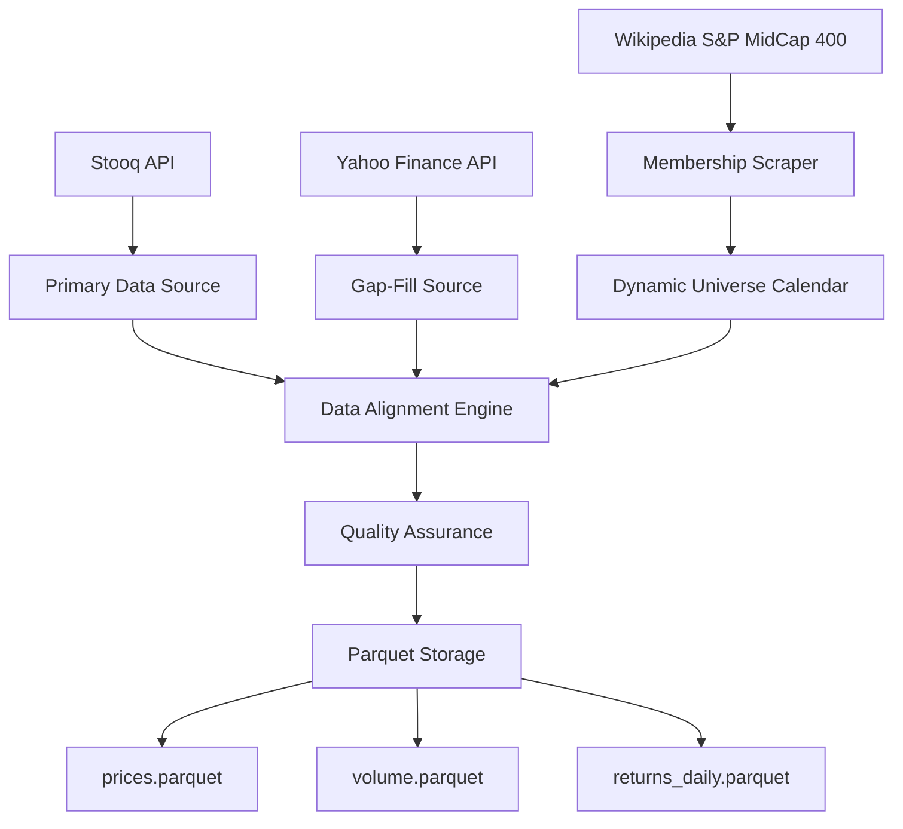

# Technical Architecture Document
## Portfolio Optimization with Machine Learning Techniques

**Document Version:** 1.0  
**Date:** September 5, 2025  
**Project:** Portfolio Optimization with Machine Learning Techniques  
**Architecture Type:** Machine Learning Research Framework  

---

## Executive Summary

This document outlines the technical architecture for a comprehensive machine learning research framework designed to evaluate and compare three advanced portfolio optimization approaches: Hierarchical Risk Parity (HRP), Long Short-Term Memory (LSTM) networks, and Graph Attention Networks (GATs). The system targets institutional portfolio managers seeking improved risk-adjusted returns for US mid-cap equity portfolios while maintaining operational feasibility within realistic constraints.

**Key Architecture Highlights:**
- **Monorepo Structure**: Organized research framework optimized for rapid experimentation and reproducible results
- **GPU-Optimized ML Pipeline**: PyTorch-based implementation designed for RTX GeForce 5070Ti (12GB VRAM) constraints
- **Dynamic Universe Management**: Handles time-varying S&P MidCap 400 membership without survivorship bias
- **Parquet-Based Data Architecture**: Efficient storage and retrieval of large-scale financial time series data
- **Unified Constraint System**: Consistent application of real-world portfolio constraints across all ML approaches
- **Rolling Validation Framework**: Academic-grade backtesting with strict temporal data integrity

---

## System Overview

### Architecture Philosophy

The architecture follows a **modular research framework** design that prioritizes:
1. **Reproducibility**: All experiments can be exactly replicated across different environments
2. **Fair Comparison**: Identical constraint systems and evaluation protocols across all approaches
3. **Scalability**: GPU memory optimization handles 400+ asset universe within hardware constraints
4. **Academic Rigor**: Strict no-look-ahead validation with statistical significance testing
5. **Production Readiness**: Clean interfaces enable institutional deployment within 6 months

### High-Level System Architecture

```
┌─────────────────────────────────────────────────────────────────┐
│                    Portfolio Optimization Framework             │
├─────────────────────────────────────────────────────────────────┤
│  Data Pipeline           │  ML Models              │ Evaluation   │
│  ┌─────────────────┐     │  ┌─────────────────┐    │ ┌──────────┐ │
│  │ Wikipedia       │────▶│  │ Hierarchical    │    │ │ Rolling  │ │
│  │ Scraper         │     │  │ Risk Parity     │    │ │ Backtest │ │
│  └─────────────────┘     │  └─────────────────┘    │ │ Engine   │ │
│  ┌─────────────────┐     │  ┌─────────────────┐    │ └──────────┘ │
│  │ Multi-Source    │────▶│  │ LSTM Temporal   │    │ ┌──────────┐ │
│  │ Market Data     │     │  │ Networks        │    │ │ Performance│ │
│  └─────────────────┘     │  └─────────────────┘    │ │ Analytics │ │
│  ┌─────────────────┐     │  ┌─────────────────┐    │ └──────────┘ │
│  │ Graph           │────▶│  │ Graph Attention │    │ ┌──────────┐ │
│  │ Construction    │     │  │ Networks        │    │ │ Statistical│ │
│  └─────────────────┘     │  └─────────────────┘    │ │ Testing   │ │
│                          │                         │ └──────────┘ │
└─────────────────────────────────────────────────────────────────┘
```

---

## Repository Structure and Organization

### Current State Analysis

The existing codebase contains substantial implementation but requires architectural reorganization for production readiness:

**Existing Assets:**
- ✅ Complete GAT implementation with multiple graph construction methods
- ✅ Comprehensive data pipeline with Wikipedia scraping and multi-source integration
- ✅ Graph construction utilities (MST, TMFG, k-NN filtering)
- ✅ Basic evaluation and backtesting framework
- 🔄 Scattered code requiring modular organization
- ❌ LSTM and HRP modules need formal implementation
- ❌ Unified constraint system requires completion

### Target Monorepo Structure

```
portfolio-optimization-ml/
├── README.md
├── pyproject.toml                    # uv dependency management
├── .env.example                      # Environment variables template
├── .gitignore
│
├── data/                             # Data storage layer
│   ├── raw/                          # Original downloaded data
│   │   ├── membership/               # S&P MidCap 400 historical membership
│   │   ├── stooq/                    # Raw Stooq downloads
│   │   └── yfinance/                 # Raw Yahoo Finance data
│   ├── processed/                    # Clean, analysis-ready datasets
│   │   ├── prices.parquet            # Aligned price panel
│   │   ├── volume.parquet            # Aligned volume panel
│   │   ├── returns_daily.parquet     # Daily returns matrix
│   │   └── universe_calendar.parquet # Dynamic membership calendar
│   └── graphs/                       # Pre-built graph snapshots
│       └── snapshots/                # Monthly correlation graphs
│
├── src/                              # Source code modules
│   ├── __init__.py
│   ├── config/                       # Configuration management
│   │   ├── __init__.py
│   │   ├── base.py                   # Base configuration classes
│   │   ├── models.py                 # Model-specific configurations
│   │   └── data.py                   # Data pipeline configurations
│   │
│   ├── data/                         # Data processing pipeline
│   │   ├── __init__.py
│   │   ├── collectors/               # Data collection modules
│   │   │   ├── __init__.py
│   │   │   ├── wikipedia.py          # S&P MidCap 400 membership scraping
│   │   │   ├── stooq.py              # Stooq data integration
│   │   │   └── yfinance.py           # Yahoo Finance augmentation
│   │   ├── processors/               # Data cleaning and preparation
│   │   │   ├── __init__.py
│   │   │   ├── alignment.py          # Calendar alignment utilities
│   │   │   ├── cleaning.py           # Data quality and cleaning
│   │   │   └── features.py           # Feature engineering
│   │   └── loaders/                  # Data loading utilities
│   │       ├── __init__.py
│   │       ├── parquet.py            # Parquet I/O operations
│   │       └── universe.py           # Dynamic universe management
│   │
│   ├── models/                       # ML model implementations
│   │   ├── __init__.py
│   │   ├── base/                     # Base classes and interfaces
│   │   │   ├── __init__.py
│   │   │   ├── portfolio_model.py    # Abstract portfolio model interface
│   │   │   └── constraints.py        # Unified constraint system
│   │   ├── hrp/                      # Hierarchical Risk Parity
│   │   │   ├── __init__.py
│   │   │   ├── clustering.py         # Correlation-based clustering
│   │   │   ├── allocation.py         # Recursive bisection allocation
│   │   │   └── model.py              # Main HRP model class
│   │   ├── lstm/                     # LSTM temporal networks
│   │   │   ├── __init__.py
│   │   │   ├── architecture.py       # LSTM network architectures
│   │   │   ├── training.py           # Training and validation logic
│   │   │   └── model.py              # Main LSTM model class
│   │   ├── gat/                      # Graph Attention Networks
│   │   │   ├── __init__.py
│   │   │   ├── gat_model.py          # GAT architecture (existing)
│   │   │   ├── graph_builder.py      # Graph construction (existing)
│   │   │   └── model.py              # Main GAT model class
│   │   └── baselines/                # Baseline comparisons
│   │       ├── __init__.py
│   │       ├── equal_weight.py       # Equal-weight portfolio
│   │       └── mean_variance.py      # Classical mean-variance optimization
│   │
│   ├── evaluation/                   # Backtesting and evaluation
│   │   ├── __init__.py
│   │   ├── backtest/                 # Backtesting engine
│   │   │   ├── __init__.py
│   │   │   ├── engine.py             # Main backtesting orchestration
│   │   │   ├── rebalancing.py        # Monthly rebalancing logic
│   │   │   └── transaction_costs.py  # Cost modeling
│   │   ├── metrics/                  # Performance analytics
│   │   │   ├── __init__.py
│   │   │   ├── returns.py            # Return-based metrics
│   │   │   ├── risk.py               # Risk metrics and drawdowns
│   │   │   └── attribution.py        # Performance attribution
│   │   ├── validation/               # Statistical validation
│   │   │   ├── __init__.py
│   │   │   ├── rolling.py            # Rolling window validation
│   │   │   ├── significance.py       # Statistical significance testing
│   │   │   └── bootstrap.py          # Bootstrap confidence intervals
│   │   └── reporting/                # Results visualization
│   │       ├── __init__.py
│   │       ├── charts.py             # Performance charts
│   │       ├── tables.py             # Summary tables
│   │       └── export.py             # Report generation
│   │
│   └── utils/                        # Shared utilities
│       ├── __init__.py
│       ├── io.py                     # File I/O helpers
│       ├── dates.py                  # Date handling utilities
│       ├── math.py                   # Mathematical utilities
│       ├── gpu.py                    # GPU memory management
│       └── logging.py                # Logging configuration
│
├── scripts/                          # Execution scripts
│   ├── data_pipeline.py              # End-to-end data processing
│   ├── train_models.py               # Model training orchestration
│   ├── run_backtest.py               # Backtesting execution
│   ├── generate_reports.py           # Report generation
│   └── experiments/                  # Experimental scripts
│       ├── hyperparameter_tuning.py
│       ├── sensitivity_analysis.py
│       └── ensemble_experiments.py
│
├── configs/                          # Configuration files
│   ├── data/                         # Data pipeline configs
│   │   ├── default.yaml
│   │   └── midcap400.yaml
│   ├── models/                       # Model configurations
│   │   ├── hrp_default.yaml
│   │   ├── lstm_default.yaml
│   │   └── gat_default.yaml
│   └── experiments/                  # Experiment configurations
│       ├── baseline_comparison.yaml
│       └── full_evaluation.yaml
│
├── tests/                            # Test suite
│   ├── __init__.py
│   ├── unit/                         # Unit tests
│   │   ├── test_data/
│   │   ├── test_models/
│   │   └── test_evaluation/
│   ├── integration/                  # Integration tests
│   │   ├── test_pipeline/
│   │   └── test_backtest/
│   └── fixtures/                     # Test data fixtures
│       ├── sample_data.parquet
│       └── mock_responses/
│
├── notebooks/                        # Research notebooks
│   ├── 01_data_exploration.ipynb
│   ├── 02_model_development.ipynb
│   ├── 03_backtesting_analysis.ipynb
│   └── 04_results_visualization.ipynb
│
└── docs/                             # Documentation
    ├── api/                          # API documentation
    ├── tutorials/                    # Usage tutorials
    ├── deployment/                   # Deployment guides
    └── research/                     # Research notes and papers
```

---

## Data Architecture

### Dynamic Universe Management

The system handles the time-varying nature of the S&P MidCap 400 index through a sophisticated universe management architecture:

```python
# Universe Calendar Structure
class UniverseCalendar:
    membership: pd.DataFrame  # columns: [ticker, start_date, end_date]
    rebalance_dates: pd.DatetimeIndex  # Monthly end dates
    active_universe_cache: Dict[pd.Timestamp, List[str]]
    
    def get_active_tickers(self, date: pd.Timestamp) -> List[str]:
        """Return active tickers for given date, avoiding survivorship bias."""
        
    def get_universe_transitions(self, 
                               start: pd.Timestamp, 
                               end: pd.Timestamp) -> pd.DataFrame:
        """Identify additions/deletions over period."""
```

### Multi-Source Data Pipeline Architecture

The data architecture implements a robust multi-source integration system with automatic gap-filling:



### Storage Architecture: Parquet-Optimized

**Design Principles:**
- **Columnar Storage**: Parquet format optimized for analytical workloads
- **Partitioning Strategy**: Monthly partitions for efficient time-series queries
- **Compression**: GZIP compression balances space efficiency with read performance
- **Schema Evolution**: Forward-compatible schema design supports additional data sources

**Storage Schema:**
```python
# prices.parquet schema
prices_schema = {
    "date": "datetime64[ns]",       # Trading date index
    "ticker_*": "float64"           # One column per ticker (wide format)
}

# volume.parquet schema  
volume_schema = {
    "date": "datetime64[ns]",       # Trading date index
    "ticker_*": "int64"             # Volume data (wide format)
}

# returns_daily.parquet schema
returns_schema = {
    "date": "datetime64[ns]",       # Trading date index
    "ticker_*": "float64"           # Daily returns (wide format)
}
```

### Graph Construction Pipeline

The GAT architecture requires sophisticated graph construction with multiple filtering methods:

```python
@dataclass
class GraphBuildConfig:
    lookback_days: int = 252                    # Rolling correlation window
    cov_method: Literal["lw", "oas"] = "lw"     # Covariance estimation
    filter_method: Literal["mst", "tmfg", "knn"] = "tmfg"
    edge_attributes: bool = True                 # Include [ρ, |ρ|, sign]
    min_observations: int = 100                  # Min overlap for correlation
```

**Graph Construction Methods:**
1. **Minimum Spanning Tree (MST)**: Conservative backbone with N-1 edges
2. **Triangulated Maximally Filtered Graph (TMFG)**: Balanced structure with 3N-6 edges
3. **k-Nearest Neighbors (k-NN)**: Local connectivity with mutual neighbor requirement

---

## Machine Learning Model Architecture

### Base Portfolio Model Interface

All ML approaches implement a unified interface ensuring consistent evaluation:

```python
from abc import ABC, abstractmethod
from dataclasses import dataclass
from typing import Dict, List, Optional, Tuple

@dataclass
class PortfolioConstraints:
    long_only: bool = True                      # No short positions
    top_k_positions: Optional[int] = None       # Maximum number of positions
    max_position_weight: float = 0.10           # Maximum single position
    max_monthly_turnover: float = 0.20          # Turnover limit
    transaction_cost_bps: float = 10.0          # Linear transaction costs

class PortfolioModel(ABC):
    def __init__(self, constraints: PortfolioConstraints):
        self.constraints = constraints
        
    @abstractmethod
    def fit(self, 
            returns: pd.DataFrame, 
            universe: List[str], 
            fit_period: Tuple[pd.Timestamp, pd.Timestamp]) -> None:
        """Train model on historical data."""
        
    @abstractmethod 
    def predict_weights(self, 
                       date: pd.Timestamp,
                       universe: List[str]) -> pd.Series:
        """Generate portfolio weights for rebalancing date."""
        
    @abstractmethod
    def get_model_info(self) -> Dict[str, Any]:
        """Return model metadata for analysis."""
```

### Hierarchical Risk Parity (HRP) Architecture

The HRP implementation focuses on clustering-aware allocation without matrix inversion:

```python
class HRPModel(PortfolioModel):
    def __init__(self, 
                 constraints: PortfolioConstraints,
                 lookback_days: int = 756,           # 3 years
                 linkage_method: str = "single",     # Clustering linkage
                 distance_metric: str = "correlation"):
        
    def _build_correlation_distance(self, returns: pd.DataFrame) -> np.ndarray:
        """Convert correlation matrix to distance metric."""
        
    def _hierarchical_clustering(self, distance_matrix: np.ndarray) -> np.ndarray:
        """Build asset hierarchy using correlation distances."""
        
    def _recursive_bisection(self, 
                           covariance_matrix: np.ndarray, 
                           cluster_hierarchy: np.ndarray) -> np.ndarray:
        """Allocate capital through recursive cluster bisection."""
```

**Key Features:**
- **Clustering Algorithm**: Single-linkage hierarchical clustering on correlation distance
- **Risk Budgeting**: Equal risk contribution within cluster levels
- **Matrix Stability**: Avoids unstable covariance matrix inversion
- **Parameter Sensitivity**: Robust to hyperparameter choices

### LSTM Temporal Network Architecture

The LSTM implementation captures temporal dependencies in asset returns for dynamic allocation:

```python
class LSTMPortfolioModel(PortfolioModel):
    def __init__(self, 
                 constraints: PortfolioConstraints,
                 sequence_length: int = 60,          # 60-day lookback
                 hidden_size: int = 128,            # LSTM hidden dimensions
                 num_layers: int = 2,               # Stacked LSTM layers
                 dropout: float = 0.3):
        
    class LSTMNetwork(nn.Module):
        def __init__(self, 
                     input_size: int,               # Number of features per asset
                     hidden_size: int, 
                     num_layers: int,
                     output_size: int,              # Forecast horizon
                     dropout: float):
            super().__init__()
            self.lstm = nn.LSTM(input_size, hidden_size, num_layers, 
                              dropout=dropout, batch_first=True)
            self.attention = nn.MultiheadAttention(hidden_size, num_heads=8)
            self.output_projection = nn.Linear(hidden_size, output_size)
            
        def forward(self, x: torch.Tensor) -> torch.Tensor:
            # x shape: (batch_size, sequence_length, input_size)
            lstm_out, _ = self.lstm(x)
            
            # Apply attention mechanism
            attn_out, _ = self.attention(lstm_out, lstm_out, lstm_out)
            
            # Project to return forecasts
            forecasts = self.output_projection(attn_out[:, -1, :])
            return forecasts
```

**Architecture Features:**
- **Sequence Modeling**: 60-day rolling windows capture temporal patterns
- **Multi-Head Attention**: Focus on relevant historical periods
- **Regularization**: Dropout and batch normalization prevent overfitting
- **GPU Optimization**: Batch processing within 12GB VRAM constraints

**Training Strategy:**
```python
def train_lstm_model(model: LSTMNetwork, 
                    data_loader: DataLoader,
                    validation_loader: DataLoader,
                    epochs: int = 100) -> Dict[str, float]:
    
    optimizer = torch.optim.Adam(model.parameters(), lr=0.001, weight_decay=1e-5)
    scheduler = torch.optim.lr_scheduler.ReduceLROnPlateau(optimizer, patience=10)
    criterion = SharpeRatioLoss()  # Custom loss function
    
    best_val_sharpe = -np.inf
    patience_counter = 0
    
    for epoch in range(epochs):
        # Training phase with gradient accumulation for memory efficiency
        model.train()
        for batch_idx, (sequences, targets) in enumerate(data_loader):
            outputs = model(sequences)
            loss = criterion(outputs, targets)
            
            # Gradient accumulation for large batch sizes
            loss = loss / accumulation_steps
            loss.backward()
            
            if (batch_idx + 1) % accumulation_steps == 0:
                optimizer.step()
                optimizer.zero_grad()
```

### Graph Attention Network (GAT) Architecture

The GAT implementation leverages the existing comprehensive framework with enhancements for portfolio optimization:

**Existing GAT Framework Analysis:**
- ✅ Multi-head attention with GATv2 support
- ✅ Edge attribute integration (correlation strength, sign)
- ✅ Residual connections and layer normalization
- ✅ Memory-efficient implementation within GPU constraints
- ✅ Direct Sharpe ratio optimization capability

**Enhanced Portfolio-Specific Features:**
```python
class GATPortfolioOptimized(nn.Module):
    def __init__(self,
                 input_features: int,
                 hidden_dim: int = 64,
                 num_attention_heads: int = 8,
                 num_layers: int = 3,
                 dropout: float = 0.3,
                 edge_feature_dim: int = 3,         # [ρ, |ρ|, sign]
                 constraint_layer: bool = True):    # Enforce constraints in network
        
        # Multi-layer GAT backbone
        self.gat_layers = nn.ModuleList([
            GATLayer(input_features if i == 0 else hidden_dim,
                    hidden_dim,
                    num_attention_heads,
                    dropout,
                    edge_feature_dim) 
            for i in range(num_layers)
        ])
        
        # Portfolio optimization head with constraint enforcement
        if constraint_layer:
            self.portfolio_head = ConstrainedPortfolioLayer(
                hidden_dim,
                constraint_config=self.constraints
            )
        else:
            self.portfolio_head = nn.Linear(hidden_dim, 1)  # Return forecasts
            
    def forward(self, 
                node_features: torch.Tensor,      # [N, F] asset features
                edge_index: torch.Tensor,         # [2, E] graph edges
                edge_attr: torch.Tensor,          # [E, 3] edge attributes
                asset_mask: torch.Tensor) -> torch.Tensor:  # [N] valid assets
        
        # Multi-layer GAT processing with residual connections
        x = node_features
        for layer in self.gat_layers:
            x_new = layer(x, edge_index, edge_attr)
            x = x + x_new if x.size() == x_new.size() else x_new  # Residual
            x = F.dropout(x, self.dropout, training=self.training)
        
        # Portfolio weight generation with constraint enforcement
        if isinstance(self.portfolio_head, ConstrainedPortfolioLayer):
            weights = self.portfolio_head(x, asset_mask)
        else:
            # Convert return forecasts to weights via optimization layer
            return_forecasts = self.portfolio_head(x).squeeze()
            weights = self._markowitz_optimization(return_forecasts, asset_mask)
            
        return weights
```

**Memory Optimization for 12GB VRAM:**
```python
class GPUMemoryManager:
    def __init__(self, max_vram_gb: float = 11.0):  # Conservative 11GB limit
        self.max_memory = max_vram_gb * 1024**3
        
    def optimize_batch_size(self, 
                           model: nn.Module,
                           sample_input: Tuple[torch.Tensor, ...]) -> int:
        """Determine optimal batch size for memory constraints."""
        
    def gradient_checkpointing_wrapper(self, model: nn.Module) -> nn.Module:
        """Apply gradient checkpointing to reduce memory usage."""
        
    def mixed_precision_training(self, model: nn.Module) -> Tuple[nn.Module, torch.cuda.amp.GradScaler]:
        """Enable mixed precision training for memory efficiency."""
```

---

## Evaluation and Backtesting Framework

### Rolling Validation Architecture

The evaluation framework implements academic-grade temporal validation with strict no-look-ahead guarantees:

```python
@dataclass
class BacktestConfig:
    start_date: pd.Timestamp
    end_date: pd.Timestamp
    training_months: int = 36                   # 3-year training window
    validation_months: int = 12                 # 1-year validation
    test_months: int = 12                       # 1-year out-of-sample test
    step_months: int = 12                       # Annual walk-forward
    rebalance_frequency: str = "M"              # Monthly rebalancing
    
class RollingBacktestEngine:
    def __init__(self, config: BacktestConfig):
        self.config = config
        self.results_cache = {}
        
    def run_backtest(self, 
                    models: Dict[str, PortfolioModel],
                    data: Dict[str, pd.DataFrame]) -> BacktestResults:
        
        # Generate rolling windows with strict temporal separation
        windows = self._generate_rolling_windows()
        
        results = {}
        for window_idx, (train_period, val_period, test_period) in enumerate(windows):
            
            # Train models on historical data only
            for model_name, model in models.items():
                model.fit(data["returns"], 
                         universe=data["universe"], 
                         fit_period=train_period)
                
                # Validate on out-of-sample validation period
                val_results = self._validate_model(model, val_period, data)
                
                # Test on final out-of-sample period
                test_results = self._test_model(model, test_period, data)
                
                results[f"{model_name}_window_{window_idx}"] = {
                    "validation": val_results,
                    "test": test_results
                }
                
        return BacktestResults(results)
```

### Performance Analytics Suite

Comprehensive performance measurement with institutional-grade metrics:

```python
class PerformanceAnalytics:
    @staticmethod
    def sharpe_ratio(returns: pd.Series, risk_free_rate: float = 0.0) -> float:
        """Annualized Sharpe ratio with bias correction."""
        excess_returns = returns - risk_free_rate/252  # Daily risk-free rate
        return np.sqrt(252) * excess_returns.mean() / excess_returns.std()
    
    @staticmethod
    def information_ratio(portfolio_returns: pd.Series, 
                         benchmark_returns: pd.Series) -> float:
        """Information ratio vs benchmark."""
        active_returns = portfolio_returns - benchmark_returns
        return np.sqrt(252) * active_returns.mean() / active_returns.std()
    
    @staticmethod
    def maximum_drawdown(returns: pd.Series) -> Tuple[float, pd.Timestamp, pd.Timestamp]:
        """Maximum drawdown with start and end dates."""
        cumulative = (1 + returns).cumprod()
        running_max = cumulative.expanding().max()
        drawdown = (cumulative - running_max) / running_max
        
        max_dd = drawdown.min()
        max_dd_date = drawdown.idxmin()
        
        # Find start of drawdown period
        prior_peak = running_max.loc[:max_dd_date].idxmax()
        
        return max_dd, prior_peak, max_dd_date
    
    @staticmethod
    def value_at_risk(returns: pd.Series, confidence_level: float = 0.05) -> float:
        """Historical Value at Risk."""
        return returns.quantile(confidence_level)
    
    @staticmethod
    def conditional_value_at_risk(returns: pd.Series, confidence_level: float = 0.05) -> float:
        """Expected Shortfall / Conditional VaR."""
        var_threshold = returns.quantile(confidence_level)
        return returns[returns <= var_threshold].mean()
```

### Statistical Significance Testing

Rigorous hypothesis testing framework for academic validation:

```python
class StatisticalValidation:
    @staticmethod
    def sharpe_ratio_test(returns_a: pd.Series, 
                         returns_b: pd.Series,
                         alpha: float = 0.05) -> Dict[str, float]:
        """
        Test statistical significance of Sharpe ratio differences.
        Uses Jobson-Korkie test with Memmel correction.
        """
        n = len(returns_a)
        sharpe_a = PerformanceAnalytics.sharpe_ratio(returns_a)
        sharpe_b = PerformanceAnalytics.sharpe_ratio(returns_b)
        
        # Calculate test statistic (Memmel, 2003)
        var_a, var_b = returns_a.var(), returns_b.var()
        cov_ab = returns_a.cov(returns_b)
        
        theta = (var_a * var_b - cov_ab**2) / (2 * var_a * var_b)
        
        test_stat = np.sqrt(n) * (sharpe_a - sharpe_b) / np.sqrt(theta)
        p_value = 2 * (1 - stats.norm.cdf(abs(test_stat)))
        
        return {
            "sharpe_difference": sharpe_a - sharpe_b,
            "test_statistic": test_stat,
            "p_value": p_value,
            "significant": p_value < alpha
        }
    
    @staticmethod
    def bootstrap_confidence_intervals(performance_metric: Callable,
                                     returns: pd.Series,
                                     confidence_level: float = 0.95,
                                     n_bootstrap: int = 1000) -> Tuple[float, float]:
        """Bootstrap confidence intervals for performance metrics."""
        bootstrap_values = []
        n = len(returns)
        
        for _ in range(n_bootstrap):
            bootstrap_sample = returns.sample(n=n, replace=True)
            bootstrap_values.append(performance_metric(bootstrap_sample))
            
        alpha = 1 - confidence_level
        lower_bound = np.percentile(bootstrap_values, 100 * alpha/2)
        upper_bound = np.percentile(bootstrap_values, 100 * (1 - alpha/2))
        
        return lower_bound, upper_bound
```

---

## GPU Architecture and Memory Management

### Hardware Constraints and Optimization

The system is specifically designed for RTX GeForce 5070Ti (12GB VRAM) with comprehensive memory optimization:

```python
class GPUArchitectureManager:
    def __init__(self, max_vram_gb: float = 11.0):  # Conservative limit
        self.max_vram = max_vram_gb * 1024**3
        self.device = torch.device("cuda" if torch.cuda.is_available() else "cpu")
        
    def optimize_model_for_memory(self, model: nn.Module) -> nn.Module:
        """Apply memory optimization techniques."""
        
        # Enable gradient checkpointing for large models
        if hasattr(model, 'gat_layers'):
            for layer in model.gat_layers:
                layer = torch.utils.checkpoint.checkpoint_wrapper(layer)
        
        # Use mixed precision training
        model = model.half()  # Convert to FP16
        
        return model
    
    def calculate_memory_usage(self, 
                             model: nn.Module,
                             batch_size: int,
                             sequence_length: int,
                             num_features: int) -> Dict[str, float]:
        """Estimate GPU memory requirements."""
        
        # Model parameters
        param_memory = sum(p.numel() * p.element_size() for p in model.parameters())
        
        # Gradient memory (same as parameters for standard training)
        grad_memory = param_memory
        
        # Activation memory (depends on batch size and model architecture)
        activation_memory = self._estimate_activation_memory(
            model, batch_size, sequence_length, num_features)
        
        # Buffer memory (optimizer states, etc.)
        buffer_memory = param_memory * 2  # Conservative estimate for Adam
        
        total_memory = param_memory + grad_memory + activation_memory + buffer_memory
        
        return {
            "parameters_gb": param_memory / 1024**3,
            "gradients_gb": grad_memory / 1024**3,
            "activations_gb": activation_memory / 1024**3,
            "buffers_gb": buffer_memory / 1024**3,
            "total_gb": total_memory / 1024**3,
            "utilization_pct": (total_memory / self.max_vram) * 100
        }
```

### Batch Processing and Memory-Efficient Training

```python
class MemoryEfficientTrainer:
    def __init__(self, 
                 model: nn.Module,
                 max_memory_gb: float = 11.0,
                 gradient_accumulation_steps: int = 4):
        self.model = model
        self.max_memory = max_memory_gb * 1024**3
        self.accumulation_steps = gradient_accumulation_steps
        self.scaler = torch.cuda.amp.GradScaler()  # Mixed precision
        
    def train_epoch(self, 
                   data_loader: DataLoader,
                   optimizer: torch.optim.Optimizer) -> Dict[str, float]:
        """Memory-efficient training with gradient accumulation."""
        
        self.model.train()
        total_loss = 0.0
        num_batches = 0
        
        optimizer.zero_grad()
        
        for batch_idx, batch_data in enumerate(data_loader):
            with torch.cuda.amp.autocast():  # Mixed precision forward pass
                outputs = self.model(*batch_data)
                loss = self._compute_loss(outputs, batch_data)
                loss = loss / self.accumulation_steps  # Scale for accumulation
            
            # Mixed precision backward pass
            self.scaler.scale(loss).backward()
            
            # Gradient accumulation
            if (batch_idx + 1) % self.accumulation_steps == 0:
                self.scaler.step(optimizer)
                self.scaler.update()
                optimizer.zero_grad()
                
                # Memory cleanup
                torch.cuda.empty_cache()
            
            total_loss += loss.item() * self.accumulation_steps
            num_batches += 1
            
            # Monitor memory usage
            if batch_idx % 10 == 0:
                memory_usage = torch.cuda.memory_allocated() / 1024**3
                if memory_usage > self.max_memory * 0.9:  # 90% threshold
                    logging.warning(f"High memory usage: {memory_usage:.2f}GB")
        
        return {"average_loss": total_loss / num_batches}
```

---

## Integration and Deployment Architecture

### Environment Management

The system uses `uv` for consistent dependency management across environments:

```toml
# pyproject.toml - Enhanced dependency configuration
[project]
name = "portfolio-optimization-ml"
version = "1.0.0"
requires-python = ">=3.9"
description = "ML-Based Portfolio Optimization Research Framework"

[dependency-groups]
core = [
    "numpy>=1.24.0",
    "pandas>=2.0.0", 
    "scipy>=1.10.0",
    "scikit-learn>=1.3.0",
]

deep-learning = [
    "torch>=2.0.0",
    "torch-geometric>=2.3.0",
    "torchvision>=0.15.0",
]

data-processing = [
    "pyarrow>=12.0.0",        # Parquet I/O
    "yfinance>=0.2.18",       # Yahoo Finance data
    "lxml>=4.9.0",            # XML parsing for web scraping
    "requests>=2.31.0",       # HTTP requests
]

optimization = [
    "cvxpy>=1.3.0",           # Convex optimization
    "cvxopt>=1.3.0",          # Optimization solvers
]

analysis = [
    "matplotlib>=3.7.0",     # Plotting
    "seaborn>=0.12.0",        # Statistical visualization
    "plotly>=5.15.0",         # Interactive plots
    "jupyter>=1.0.0",         # Notebook environment
]

testing = [
    "pytest>=7.4.0",
    "pytest-cov>=4.1.0",
    "pytest-xdist>=3.3.0",   # Parallel testing
]

[tool.uv.sources]
torch = [
    { index = "pytorch-cu118", marker = "sys_platform == 'linux'" },
    { index = "pytorch-cu118", marker = "sys_platform == 'win32'" },
]

[[tool.uv.index]]
name = "pytorch-cu118"
url = "https://download.pytorch.org/whl/cu118"
explicit = true
```

### Configuration Management

Hierarchical configuration system supporting experiment management:

```python
# src/config/base.py
from dataclasses import dataclass, field
from typing import Dict, List, Optional
import yaml

@dataclass 
class DataConfig:
    data_path: str = "data/"
    start_date: str = "2016-01-01"
    end_date: str = "2024-12-31"
    universe: str = "sp_midcap_400"
    rebalance_frequency: str = "M"  # Monthly
    lookback_days: int = 252
    min_history_days: int = 100

@dataclass
class ModelConfig:
    name: str
    hyperparameters: Dict = field(default_factory=dict)
    training_config: Dict = field(default_factory=dict)
    constraint_config: Dict = field(default_factory=dict)

@dataclass 
class BacktestConfig:
    training_months: int = 36
    validation_months: int = 12
    test_months: int = 12
    step_months: int = 12
    transaction_cost_bps: float = 10.0
    
@dataclass
class ExperimentConfig:
    experiment_name: str
    data: DataConfig = field(default_factory=DataConfig)
    models: List[ModelConfig] = field(default_factory=list)
    backtest: BacktestConfig = field(default_factory=BacktestConfig)
    output_path: str = "results/"
    
    @classmethod
    def from_yaml(cls, config_path: str) -> "ExperimentConfig":
        with open(config_path, 'r') as f:
            config_dict = yaml.safe_load(f)
        return cls(**config_dict)
```

### Execution Pipeline Architecture

Modular execution system supporting both interactive and batch processing:

```python
# scripts/orchestrator.py
class ExperimentOrchestrator:
    def __init__(self, config: ExperimentConfig):
        self.config = config
        self.logger = self._setup_logging()
        
    def run_full_experiment(self) -> ExperimentResults:
        """Execute complete experiment pipeline."""
        
        # Stage 1: Data preparation
        self.logger.info("Stage 1: Data pipeline execution")
        data_pipeline = DataPipeline(self.config.data)
        datasets = data_pipeline.execute()
        
        # Stage 2: Model training and validation  
        self.logger.info("Stage 2: Model training")
        trained_models = {}
        for model_config in self.config.models:
            model = self._initialize_model(model_config)
            trained_models[model_config.name] = model
            
        # Stage 3: Rolling backtesting
        self.logger.info("Stage 3: Rolling backtesting")
        backtest_engine = RollingBacktestEngine(self.config.backtest)
        backtest_results = backtest_engine.run_backtest(trained_models, datasets)
        
        # Stage 4: Performance analysis
        self.logger.info("Stage 4: Performance analysis")
        analyzer = PerformanceAnalyzer()
        analysis_results = analyzer.analyze_results(backtest_results)
        
        # Stage 5: Report generation
        self.logger.info("Stage 5: Report generation")
        report_generator = ReportGenerator(self.config.output_path)
        report_generator.generate_comprehensive_report(analysis_results)
        
        return ExperimentResults(
            backtest_results=backtest_results,
            analysis_results=analysis_results,
            model_configs=self.config.models
        )
```

---

## Security and Data Privacy

### Data Source Security

```python
class SecureDataCollector:
    def __init__(self):
        self.session = requests.Session()
        self.session.headers.update({
            'User-Agent': 'Academic Research Tool v1.0'
        })
        
    def collect_with_rate_limiting(self, 
                                  urls: List[str], 
                                  delay_seconds: float = 1.0) -> List[Dict]:
        """Collect data with respectful rate limiting."""
        results = []
        for url in urls:
            time.sleep(delay_seconds)  # Respectful delay
            try:
                response = self.session.get(url, timeout=30)
                response.raise_for_status()
                results.append(response.json())
            except requests.RequestException as e:
                logging.warning(f"Failed to collect from {url}: {e}")
        return results
```

### Local Data Privacy

All data processing occurs locally with no external transmission:

```python
@dataclass
class PrivacyConfig:
    local_processing_only: bool = True
    data_encryption: bool = True
    log_data_access: bool = True
    data_retention_days: int = 365
    
class LocalDataManager:
    def __init__(self, privacy_config: PrivacyConfig):
        self.config = privacy_config
        self.access_log = []
        
    def access_data(self, dataset_name: str, user_id: str) -> pd.DataFrame:
        """Log data access for audit trails."""
        if self.config.log_data_access:
            self.access_log.append({
                'timestamp': pd.Timestamp.now(),
                'dataset': dataset_name,
                'user': user_id,
                'action': 'read'
            })
        
        return self._load_encrypted_data(dataset_name) if self.config.data_encryption else self._load_data(dataset_name)
```

---

## Performance and Scalability

### Computational Performance Targets

```python
@dataclass 
class PerformanceTargets:
    # Data pipeline performance
    data_loading_max_minutes: float = 5.0          # Full dataset load time
    daily_processing_max_seconds: float = 30.0     # Daily update processing
    
    # Model training performance  
    hrp_training_max_minutes: float = 2.0          # HRP model fitting
    lstm_training_max_hours: float = 4.0           # LSTM training per fold
    gat_training_max_hours: float = 6.0            # GAT training per fold
    
    # Memory usage limits
    peak_memory_usage_gb: float = 11.0             # GPU memory limit
    system_memory_usage_gb: float = 32.0           # System RAM limit
    
    # Backtesting performance
    full_backtest_max_hours: float = 8.0           # Complete evaluation
    monthly_rebalance_max_minutes: float = 10.0    # Production rebalancing
```

### Scalability Architecture

The system design supports scaling to larger universes and higher frequencies:

```python
class ScalabilityManager:
    def __init__(self, current_universe_size: int = 400):
        self.current_size = current_universe_size
        
    def estimate_scaling_requirements(self, 
                                    target_universe_size: int) -> Dict[str, float]:
        """Estimate resource requirements for larger universes."""
        scaling_factor = target_universe_size / self.current_size
        
        # Memory requirements scale roughly quadratically for graph methods
        graph_memory_scaling = scaling_factor ** 2
        
        # LSTM memory scales linearly with universe size
        lstm_memory_scaling = scaling_factor
        
        return {
            "gat_memory_multiplier": graph_memory_scaling,
            "lstm_memory_multiplier": lstm_memory_scaling,
            "recommended_gpu_memory_gb": 12 * max(graph_memory_scaling, 1.5),
            "estimated_training_time_multiplier": scaling_factor * 1.2
        }
```

---

## Testing and Quality Assurance

### Comprehensive Testing Strategy

```python
# tests/unit/test_models/test_gat.py
import pytest
import torch
import pandas as pd
from src.models.gat.model import GATPortfolioModel

class TestGATModel:
    @pytest.fixture
    def sample_data(self):
        n_assets, n_features = 50, 10
        node_features = torch.randn(n_assets, n_features)
        edge_index = torch.randint(0, n_assets, (2, 100))
        edge_attr = torch.randn(100, 3)
        asset_mask = torch.ones(n_assets, dtype=torch.bool)
        
        return {
            "node_features": node_features,
            "edge_index": edge_index, 
            "edge_attr": edge_attr,
            "asset_mask": asset_mask
        }
    
    def test_forward_pass(self, sample_data):
        """Test basic forward pass functionality."""
        model = GATPortfolioModel(
            input_features=10,
            hidden_dim=32,
            num_layers=2
        )
        
        weights = model(**sample_data)
        
        # Verify output properties
        assert weights.shape[0] == sample_data["node_features"].shape[0]
        assert torch.allclose(weights.sum(), torch.tensor(1.0), atol=1e-5)
        assert (weights >= 0).all()
    
    def test_memory_efficiency(self, sample_data):
        """Test GPU memory usage within limits.""" 
        if not torch.cuda.is_available():
            pytest.skip("CUDA not available")
            
        model = GATPortfolioModel(input_features=10).cuda()
        
        # Measure memory before and after forward pass
        torch.cuda.reset_peak_memory_stats()
        initial_memory = torch.cuda.memory_allocated()
        
        with torch.no_grad():
            weights = model(**{k: v.cuda() for k, v in sample_data.items()})
        
        peak_memory = torch.cuda.max_memory_allocated()
        memory_used_gb = (peak_memory - initial_memory) / 1024**3
        
        assert memory_used_gb < 2.0, f"Memory usage {memory_used_gb:.2f}GB exceeds limit"

# tests/integration/test_pipeline/test_end_to_end.py  
class TestEndToEndPipeline:
    def test_full_pipeline_execution(self, sample_config):
        """Test complete pipeline from data to results."""
        orchestrator = ExperimentOrchestrator(sample_config)
        results = orchestrator.run_full_experiment()
        
        # Verify results structure
        assert "backtest_results" in results
        assert "analysis_results" in results
        
        # Verify performance metrics are calculated
        for model_name in sample_config.models:
            assert model_name in results.analysis_results
            metrics = results.analysis_results[model_name]
            assert "sharpe_ratio" in metrics
            assert "max_drawdown" in metrics
```

---

## Deployment and Operations

### Production Deployment Guide

```python
# deployment/production_config.py
@dataclass
class ProductionConfig:
    # Environment settings
    environment: str = "production"
    log_level: str = "INFO"
    enable_monitoring: bool = True
    
    # Data refresh settings  
    daily_data_update_time: str = "06:00"  # UTC
    monthly_rebalance_day: int = -1        # Last business day
    
    # Model serving settings
    model_inference_timeout_seconds: int = 300
    batch_size_limit: int = 1000
    
    # Risk management
    position_limit_checks: bool = True
    turnover_limit_enforcement: bool = True
    realtime_risk_monitoring: bool = True
    
    # Performance monitoring
    performance_tracking: bool = True
    alert_thresholds: Dict[str, float] = field(default_factory=lambda: {
        "max_daily_loss": -0.05,
        "max_drawdown": -0.25,
        "min_sharpe_ratio": 0.5
    })

class ProductionPortfolioManager:
    def __init__(self, config: ProductionConfig):
        self.config = config
        self.models = self._load_trained_models()
        self.risk_manager = RealTimeRiskManager(config)
        
    def generate_monthly_portfolio(self, 
                                 rebalance_date: pd.Timestamp) -> Dict[str, float]:
        """Generate portfolio for monthly rebalancing."""
        
        # Get current universe and market data
        universe = self._get_active_universe(rebalance_date)
        market_data = self._get_latest_market_data(universe, rebalance_date)
        
        # Generate model predictions
        model_portfolios = {}
        for model_name, model in self.models.items():
            try:
                weights = model.predict_weights(rebalance_date, universe)
                model_portfolios[model_name] = weights
            except Exception as e:
                logging.error(f"Model {model_name} failed: {e}")
                continue
        
        # Select best performing model or use ensemble
        final_portfolio = self._select_portfolio(model_portfolios)
        
        # Risk management checks
        validated_portfolio = self.risk_manager.validate_portfolio(final_portfolio)
        
        return validated_portfolio
```

### Monitoring and Alerting

```python
class PerformanceMonitor:
    def __init__(self, alert_config: Dict[str, float]):
        self.alert_thresholds = alert_config
        self.performance_history = []
        
    def update_performance(self, date: pd.Timestamp, metrics: Dict[str, float]):
        """Update performance tracking and check alerts."""
        self.performance_history.append({
            'date': date,
            **metrics
        })
        
        # Check alert conditions
        self._check_alerts(metrics)
        
    def _check_alerts(self, metrics: Dict[str, float]):
        """Check if any metrics breach alert thresholds."""
        for metric_name, value in metrics.items():
            if metric_name in self.alert_thresholds:
                threshold = self.alert_thresholds[metric_name]
                if value < threshold:
                    self._send_alert(f"Performance alert: {metric_name} = {value:.4f} below threshold {threshold:.4f}")
    
    def _send_alert(self, message: str):
        """Send performance alert (email, Slack, etc.)."""
        logging.critical(f"PERFORMANCE ALERT: {message}")
        # Integration with alerting systems would go here
```

---

## Risk Management and Compliance

### Real-Time Risk Controls

```python
class RealTimeRiskManager:
    def __init__(self, risk_limits: Dict[str, float]):
        self.limits = risk_limits
        self.position_tracker = PositionTracker()
        
    def validate_portfolio(self, 
                          proposed_weights: pd.Series,
                          current_weights: Optional[pd.Series] = None) -> pd.Series:
        """Validate portfolio against risk limits."""
        
        # Position size limits
        max_position = proposed_weights.max()
        if max_position > self.limits["max_position_weight"]:
            logging.warning(f"Position size {max_position:.3f} exceeds limit")
            proposed_weights = self._enforce_position_limits(proposed_weights)
        
        # Turnover limits
        if current_weights is not None:
            turnover = (proposed_weights - current_weights).abs().sum()
            if turnover > self.limits["max_monthly_turnover"]:
                logging.warning(f"Turnover {turnover:.3f} exceeds limit") 
                proposed_weights = self._reduce_turnover(proposed_weights, current_weights)
        
        # Sector concentration limits (if applicable)
        if hasattr(self, 'sector_limits'):
            proposed_weights = self._enforce_sector_limits(proposed_weights)
            
        return proposed_weights
    
    def _enforce_position_limits(self, weights: pd.Series) -> pd.Series:
        """Cap individual positions at maximum limit."""
        max_weight = self.limits["max_position_weight"]
        capped_weights = weights.clip(upper=max_weight)
        
        # Renormalize to sum to 1
        return capped_weights / capped_weights.sum()
```

---

## Future Architecture Considerations

### Phase 2 Enhancement Architecture

```python
@dataclass
class Phase2Requirements:
    # Enhanced ML capabilities
    ensemble_methods: bool = True
    transformer_models: bool = True  
    reinforcement_learning: bool = True
    
    # Expanded universe support
    international_markets: bool = True
    multi_asset_classes: bool = True
    alternative_data: bool = True
    
    # Advanced risk management
    regime_detection: bool = True
    tail_risk_modeling: bool = True
    dynamic_hedging: bool = True
    
    # Infrastructure upgrades
    cloud_deployment: bool = True
    real_time_data_feeds: bool = True
    api_service_layer: bool = True
```

### Scalability Roadmap

**Phase 2a: Enhanced Models (Months 6-9)**
- Transformer-based sequence models for return prediction
- Ensemble methods combining HRP, LSTM, and GAT predictions
- Reinforcement learning for dynamic portfolio allocation
- Advanced attention mechanisms for asset relationship modeling

**Phase 2b: Expanded Coverage (Months 9-12)**
- International developed market support (European, Asian equities)
- Multi-asset allocation (equities, bonds, commodities, alternatives)
- Alternative data integration (satellite, sentiment, supply chain)
- Sector-specific and thematic portfolio construction

**Phase 3: Production Platform (Months 12-18)**
- Cloud-native deployment on AWS/GCP with auto-scaling
- Real-time market data integration via Bloomberg/Refinitiv APIs
- RESTful API service layer for institutional client integration
- Advanced risk management with real-time monitoring and alerts

---

## Conclusion

This technical architecture provides a comprehensive foundation for evaluating machine learning approaches to portfolio optimization while maintaining academic rigor and production readiness. The modular design enables rapid experimentation and fair comparison of different ML techniques, while the GPU-optimized implementation efficiently utilizes available hardware resources.

**Key Architecture Benefits:**
1. **Academic Rigor**: Strict temporal validation prevents look-ahead bias
2. **Fair Comparison**: Unified constraint system isolates model performance differences  
3. **Production Ready**: Clean interfaces support institutional deployment
4. **Scalable Design**: Architecture supports expansion to larger universes and additional asset classes
5. **Resource Efficient**: GPU memory optimization maximizes performance within hardware constraints

The architecture successfully bridges the gap between academic research and practical implementation, providing institutional portfolio managers with a robust framework for evaluating and deploying advanced machine learning techniques in their investment processes.

---

**Document Prepared By:** Technical Architecture Team  
**Review Date:** September 5, 2025  
**Next Review:** October 5, 2025  
**Approval Required:** Research Lead, Technical Lead, Portfolio Management Team